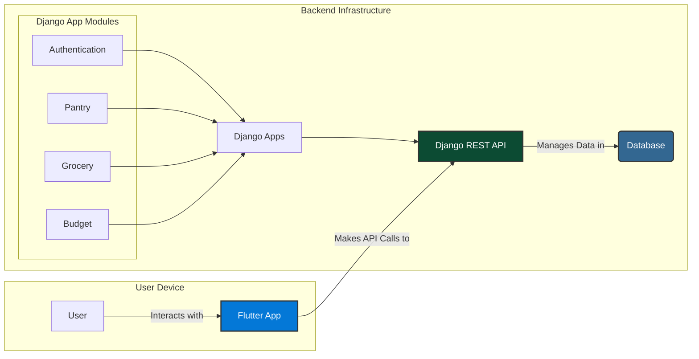

# Grocery Management App

A full-stack mobile application designed to streamline your grocery shopping experience, helping you manage your pantry, plan shopping trips, and stick to your budget.

## Features

- **User Authentication**: Secure user sign-up and login.
- **Pantry Management**: Keep track of items you have at home.
- **Grocery Trip Planning**: Create and manage shopping lists for your grocery runs.
- **Budget Tracking**: Set and monitor monthly budgets to control your spending.
- **Store Management**: Save your favorite grocery store locations.

## Tech Stack

This project is a full-stack application composed of a Flutter frontend and a Django backend.



| Component      | Technology                                                                                                  |
| -------------- | ----------------------------------------------------------------------------------------------------------- |
| **Frontend**   | [Flutter](https://flutter.dev/) (SDK `^3.9.2`)                                                              |
| **Backend**    | [Django](https://www.djangoproject.com/) ([Python](https://www.python.org/) `3.12`)                            |
| **API**        | [Django REST Framework](https://www.django-rest-framework.org/)                                             |
| **State Mgmt** | [flutter_bloc](https://pub.dev/packages/flutter_bloc)                                                       |
| **HTTP Client**| [Dio](https://pub.dev/packages/dio) (Flutter)                                                              |

## Project Structure

The repository is organized into two main directories:

- `frontend/`: Contains the Flutter mobile application.
- `backend/`: Contains the Django REST API server.

Each directory has its own set of dependencies and configurations.

## Getting Started

### Prerequisites

- [Flutter](https://flutter.dev/docs/get-started/install)
- [Python](https://www.python.org/downloads/) 3.12
- [Pipenv](https://pipenv.pypa.io/en/latest/installation/)

### Backend Setup

1.  **Navigate to the backend directory:**
    ```sh
    cd backend
    ```

2.  **Install dependencies:**
    ```sh
    pipenv install
    ```

3.  **Activate the virtual environment:**
    ```sh
    pipenv shell
    ```

4.  **Apply database migrations:**
    ```sh
    python manage.py migrate
    ```

5.  **Start the development server:**
    ```sh
    python manage.py runserver
    ```
    The backend will be running at `http://127.0.0.1:8000`.

### Frontend Setup

1.  **Navigate to the frontend directory:**
    ```sh
    cd frontend
    ```

2.  **Install dependencies:**
    ```sh
    flutter pub get
    ```
    
3.  **Run code generation:**
    ```sh
    dart run build_runner build
    ```

4.  **Run the app:**
    ```sh
    flutter run
    ```

## License

This project is licensed under the terms of the LICENSE file.
